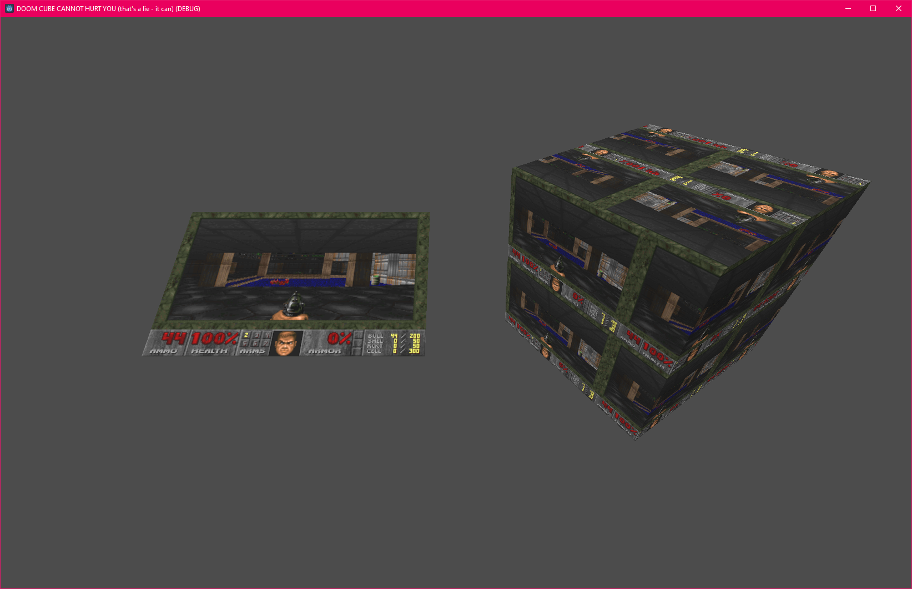

# doom-godot

Want to make your Godot game a bajillion times better? Add DOOM to it! This GDExtension allows you to do just that...



This repository structure is based on [GDExtensionTemplate](https://github.com/asmaloney/GDExtensionTemplate) and is currently set up to work with the **[Godot 4.1](https://github.com/godotengine/godot/releases/tag/4.1-stable)** release. [PureDOOM](https://github.com/Daivuk/PureDOOM) source port is used for the actual DOOM implementation, and is included as a submodule (see [extern/puredoom](extern/puredoom/)).

## Prerequisites

To use this locally on your machine, you will need the following:

- **[CMake](https://cmake.org/)** v3.22+
- C++ Compiler with at least **C++17** support (any recent compiler)
- (optional) **[ccache](https://ccache.dev/)** for faster rebuilds

## Build

Here's an example of how to build a release version (use the terminal to run the following commands in the parent directory of this repo):

### Not MSVC

```sh
cmake -B build -S . -DCMAKE_BUILD_TYPE=Release -DCMAKE_INSTALL_PREFIX=doom-godot-install
cmake --build ./build --parallel
```

### MSVC

```powershell
cmake -B build -S . -G "Visual Studio 17 2022" -DCMAKE_BUILD_TYPE=Release -DCMAKE_INSTALL_PREFIX=doom-godot-install
cmake --build ./build --config Release
```

This tells CMake to use `Visual Studio 2022`. There is a list of Visual Studio generators [on the CMake site](https://cmake.org/cmake/help/latest/manual/cmake-generators.7.html#visual-studio-generators) - pick the one you are using.

## Cmake Options

The following additional CMake options are available:

| Option                                                                   | Description                                      | Default                                                                                              |
|--------------------------------------------------------------------------|--------------------------------------------------|------------------------------------------------------------------------------------------------------|
| `CCACHE_PROGRAM`                                                         | Path to `ccache` for faster rebuilds             | This is automatically set **ON** if `ccache` is found. If you do not want to use it, set this to "". |
| `${PROJECT_NAME_UPPERCASE}_WARN_EVERYTHING` (e.g. FOO_WARN_EVERYTHING)   | Turns on all warnings. (Not available for MSVC.) | **OFF** (too noisy, but can be useful sometimes)                                                     |
| `${PROJECT_NAME_UPPERCASE}_WARNING_AS_ERROR` (e.g. FOO_WARNING_AS_ERROR) | Turns warnings into errors.                      | **ON**                                                                                               |

# Usage

1. Create a new GDScript, with the following content:

```GDScript
extends MeshInstance3D

func _ready():
	_init_doom()
	
var doom: Doom
var active = false

func _init_doom():
	if doom == null:
		doom = Doom.new()
		add_child(doom)
	doom.initialize()
	if self.material_override == null:
		self.material_override = StandardMaterial3D.new()
		self.material_override.shading_mode = BaseMaterial3D.SHADING_MODE_UNSHADED
	self.material_override.albedo_texture = ImageTexture.create_from_image(doom.get_framebuffer())

func check_key(godot_key, doom_key, key_is_pressed):
	if Input.is_key_pressed(godot_key):
		doom.key_down(doom_key)
	else:
		doom.key_up(doom_key)

func _unhandled_key_input(event):
	if event is InputEventKey:
		check_key(KEY_W, 173, event.is_pressed())
		check_key(KEY_A, 172, event.is_pressed())
		check_key(KEY_S, 175, event.is_pressed())
		check_key(KEY_D, 174, event.is_pressed())
		check_key(KEY_UP, 173, event.is_pressed())
		check_key(KEY_LEFT, 172, event.is_pressed())
		check_key(KEY_DOWN, 175, event.is_pressed())
		check_key(KEY_RIGHT, 174, event.is_pressed())
		check_key(KEY_SPACE, KEY_SPACE, event.is_pressed())
		check_key(KEY_CTRL, 157, event.is_pressed())
		check_key(KEY_ENTER, 13, event.is_pressed())
		check_key(KEY_ESCAPE, 27, event.is_pressed())

func _process(delta):
	if doom != null:
		doom.update()
		self.material_override.albedo_texture.set_image(doom.get_framebuffer())
```

2. Create a MeshInstance3D and attach the script to it!
3. Copy a DOOM IWAD to your project root folder, or instruct your end-users to copy such an IWAD to whatever your game's working directory is. Make sure the IWAD is named "DOOM.WAD". Users without a licensed copy of DOOM can use [FreeDOOM](https://freedoom.github.io/download.html), instead.

